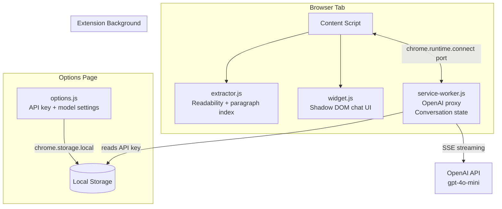

# ✨ Article Summarizer

A browser extension that injects a floating AI chatbot onto any webpage. Summarize articles and ask follow-up questions — with every AI claim grounded in clickable paragraph-level references back to the source text.

Powered by OpenAI GPT-4o-mini. Works in **Chrome** and **Firefox**.

> **AI Disclaimer:** The majority of this codebase was generated with AI assistance (Warp / Oz). All generated code has been reviewed, tested, and is maintained by human contributors.

---

## Features

- **Floating chat widget** — shadow DOM isolated, won't break page styles
- **Article extraction** — uses Mozilla Readability (same engine as Firefox Reader View)
- **Paragraph references** — every AI response cites `[p-N]` paragraph numbers
- **Click-to-scroll** — click a reference chip to jump to and highlight the source paragraph
- **Streaming responses** — tokens appear as they arrive
- **Follow-up Q&A** — full conversation history maintained per tab
- **Chrome + Firefox** — single codebase, build-time manifest swap

---

## Architecture



### Component Responsibilities

| Component         | File                           | Role                                                        |
| ----------------- | ------------------------------ | ----------------------------------------------------------- |
| Content Script    | `content/content.js`           | Orchestration entry point                                   |
| Article Extractor | `content/extractor.js`         | Readability parsing + paragraph indexing + scroll/highlight |
| Chat Widget       | `content/widget.js`            | Shadow DOM UI, streaming renderer, reference chips          |
| Background Worker | `background/service-worker.js` | OpenAI proxy, conversation state, streaming, retries        |
| Options Page      | `options/options.js`           | API key storage + validation                                |

---

## Setup

**Prerequisites:** Node.js 18+, a Chrome or Firefox browser, and an [OpenAI API key](https://platform.openai.com/api-keys).

### 1. Install & Build

```bash
git clone https://github.com/lightshadow1/browser-buddy.git
cd browser-buddy
npm install
node build.js
# Outputs: dist/chrome/ and dist/firefox/
```

### 2. Load in Chrome

1. Go to `chrome://extensions`
2. Enable **Developer Mode** (top right toggle)
3. Click **Load unpacked** → select `dist/chrome/`

### 3. Load in Firefox

1. Go to `about:debugging#/runtime/this-firefox`
2. Click **Load Temporary Add-on** → select `dist/firefox/manifest.json`

### 4. Set Your API Key

Click the extension icon → **Settings** (or right-click the extension → Options) → enter your OpenAI API key → Save.

---

## Usage

1. Navigate to any article (news site, blog, Wikipedia, etc.)
2. Click the **💬 chat bubble** in the bottom-right corner
3. Click **Summarize** to get a grounded summary
4. Click any **[N] reference chip** to jump to that paragraph in the article
5. Type follow-up questions in the input bar

---

## Development

```bash
npm run lint          # ESLint check
npm run format        # Prettier format
npm test              # Jest test suite
npm run test:coverage # With coverage report
npm run presubmit     # Full pre-PR check: lint + format + test
node build.js         # Build both Chrome and Firefox
```

See [CONTRIBUTING.md](CONTRIBUTING.md) for the full contributor guide.

---

## Security

- Your API key is stored **only locally** (`chrome.storage.local`) — never sent to any server other than `api.openai.com`
- All OpenAI calls are made from the **background service worker** — never from the content script
- AI-generated HTML is sanitized with **DOMPurify** before rendering
- The widget runs in a **shadow DOM** — isolated from host page styles and scripts

See [SECURITY.md](SECURITY.md) for the full security model and vulnerability reporting process.

---

## Data & Privacy

Article text is sent to OpenAI using **your own API key** under [OpenAI's privacy policy](https://openai.com/policies/privacy-policy). This extension collects no telemetry and stores nothing remotely.

---

## Vendored Libraries

| Library                                                       | Version | License              |
| ------------------------------------------------------------- | ------- | -------------------- |
| [Mozilla Readability](https://github.com/mozilla/readability) | latest  | Apache 2.0           |
| [marked.js](https://marked.js.org)                            | latest  | MIT                  |
| [DOMPurify](https://github.com/cure53/DOMPurify)              | latest  | Apache 2.0 / MPL 2.0 |

---

## Roadmap

See [CHANGELOG.md](CHANGELOG.md). Planned features:

- Reference tooltip on hover (paragraph preview)
- Draggable/resizable panel
- Dark mode (follows system preference)
- Keyboard shortcut (Cmd+Shift+S)
- Copy summary as Markdown
- Plugin system for saving to Notion, Google Drive, Obsidian

---

## Contributing

See [CONTRIBUTING.md](CONTRIBUTING.md). Please read [CODE_OF_CONDUCT.md](CODE_OF_CONDUCT.md) before contributing.

## License

[MIT](LICENSE)
